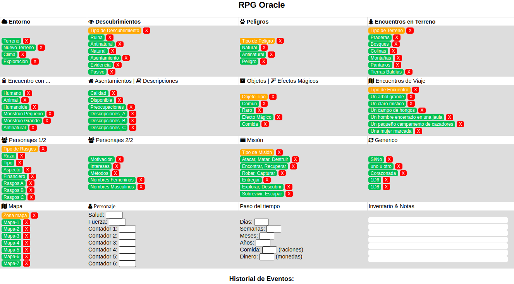
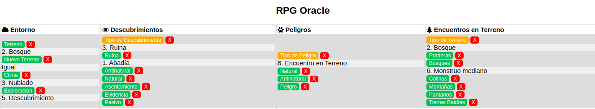
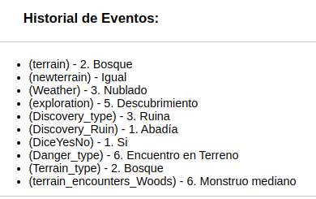
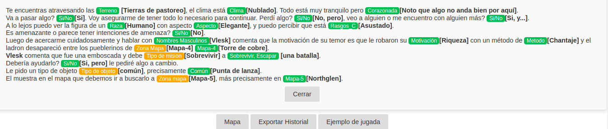
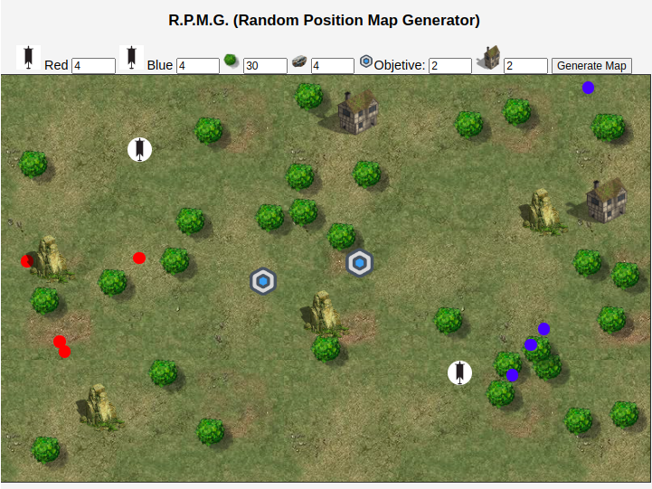
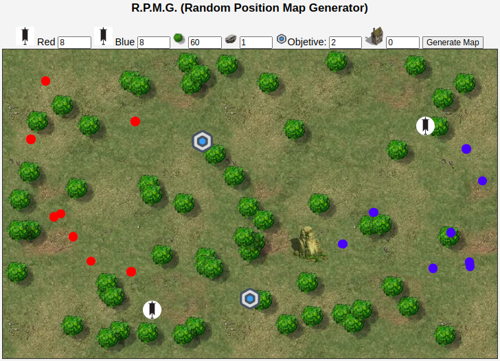

# rpg-oracle
This is a web/app to generate a simple RPG history. You can create "on the fly" the history, environment, objectives, quest and more.  ...Go ahead and be yourself in mysterious world!!!

 ## try it online:  [rpg-oracle](https://jpradoar.github.io/rpg-resources/)

   
  
  
  
  

 

* Yellow buttons: To randomize options.
* Green buttons: To generate 1d6 action,encounter, etc. 
* Red buttons: To clear specific text or output button

  
 

 # R.P.M.G. (Random Position Map Generator)
A simple tool that allows you to quickly and automatically create maps for role-playing games or skirmishes. 
You can use it to play "on it" or to recreate the scenario in your real tabletop using you our markers and tokens

## try it online:  [R.P.M.G. (Random Position Map Generator)](https://jpradoar.github.io/rpg-resources/rpmg.html)

 

   
   

