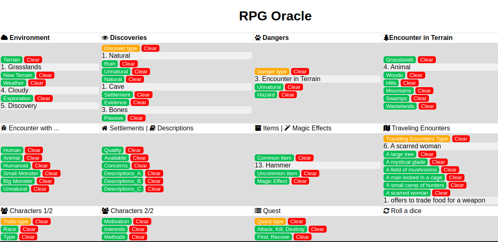

# rpg-oracle
This is a web/app to generate a simple RPG history. You can create "on the fly" the history, environment, objectives, quest and more.  ...Go ahead and be yourself in mysterious world!!!

try it online:  https://jpradoar.github.io/rpg-oracle/
  

 

* Yellow buttons: To randomize options.
* Green buttons: To generate 1d6 action,encounter, etc. 
* Red buttons: To clear specific text or output button

 

